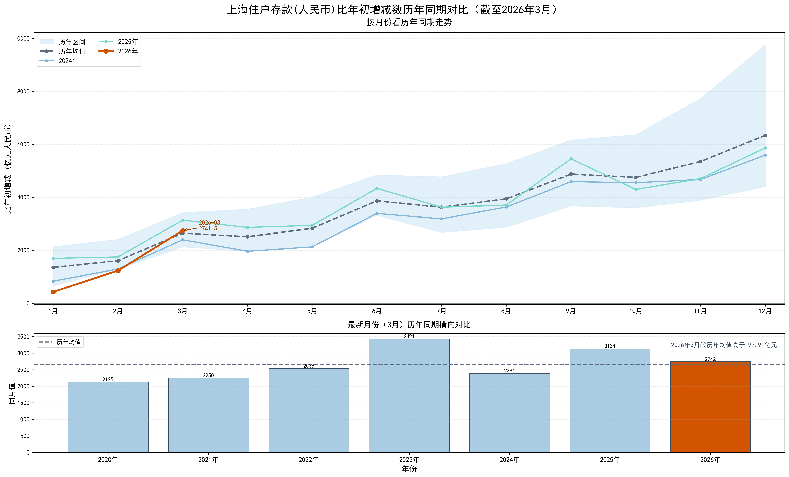
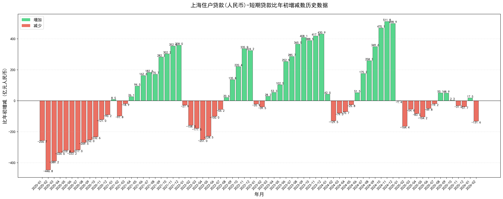
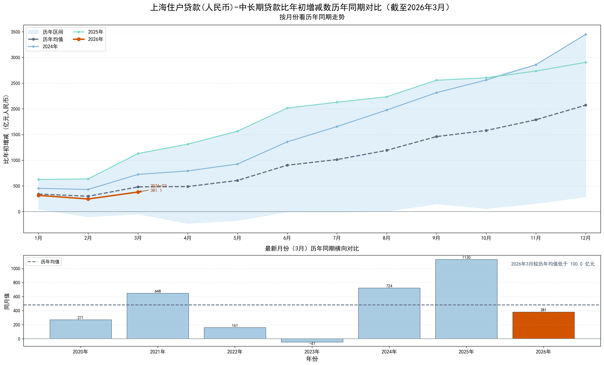

# 上海金融统计数据爬虫与可视化

一个用于爬取上海市金融统计数据并生成可视化图表的自动化工具。

## 📋 项目简介

本项目从中国人民银行上海总部官网自动获取最新的上海市金融统计数据（包括存款、贷款等信息），将Excel数据解析为JSON格式，并生成可视化图表。

## 注意

官网部分月份的excel数据没有发布，采用官方微信公众号公布的数据手动制作成excel：

- 2020年10月
- 2020年12月
- 2021年2月

## 📊 部分数据可视化

### 住户存款比年初增减数

展示上海市住户存款相对于年初的增减变化趋势。

### 住户短期贷款比年初增减数

展示上海市住户短期贷款相对于年初的增减变化趋势。

### 住户中长期贷款比年初增减数

展示上海市住户中长期贷款相对于年初的增减变化趋势。

