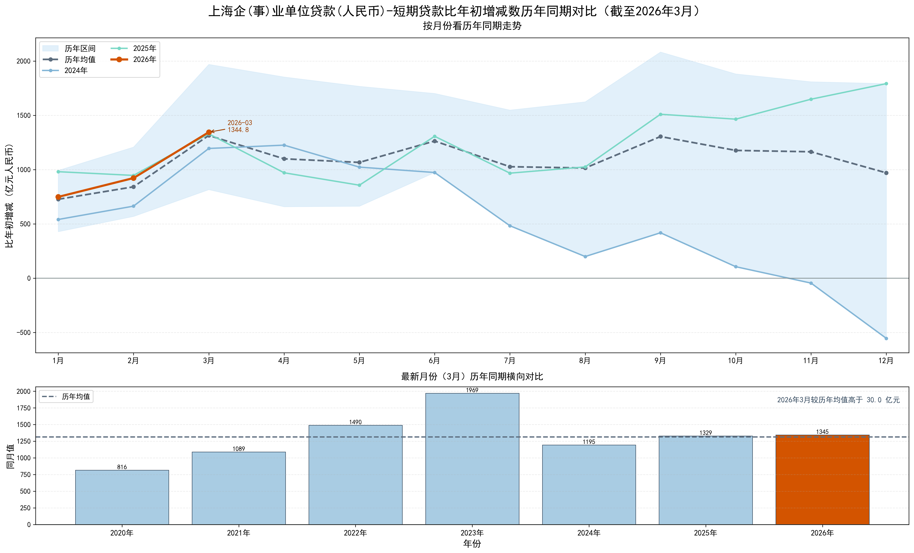
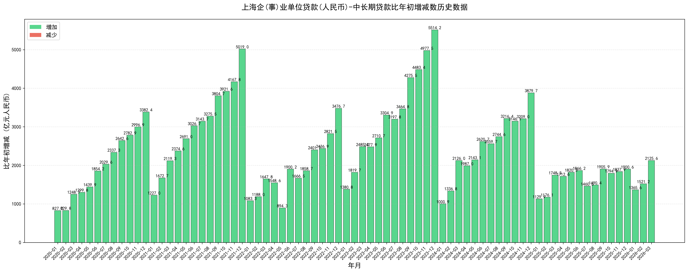

# 上海金融统计数据可视化

自动更新上海市金融统计数据并生成可视化图表的仓库。目前主要展示住户存贷款数据和企事业单位的贷款数据。

数据来源：[中国人民银行上海总部-金融数据](http://shanghai.pbc.gov.cn/fzhshanghai/113592/13954/index1.html)

## 📋 项目简介

本项目从中国人民银行上海总部官网自动获取最新的上海市金融统计数据（包括存款、贷款等信息），并生成最近24个月的可视化图表。

## 📊 数据可视化

### 住户存款比年初增减数

展示上海市住户存款相对于年初的增减变化趋势。

### 住户短期贷款比年初增减数

展示上海市住户短期贷款相对于年初的增减变化趋势。

### 住户中长期贷款比年初增减数

展示上海市住户中长期贷款相对于年初的增减变化趋势。

### 企事业单位短期贷款比年初增减数

### 企事业单位中长期贷款比年初增减数

## Star History

